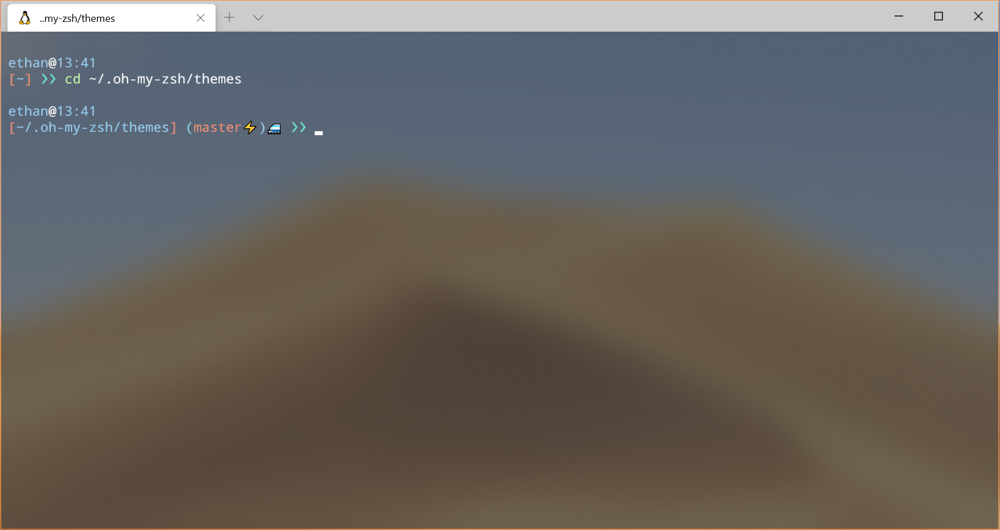
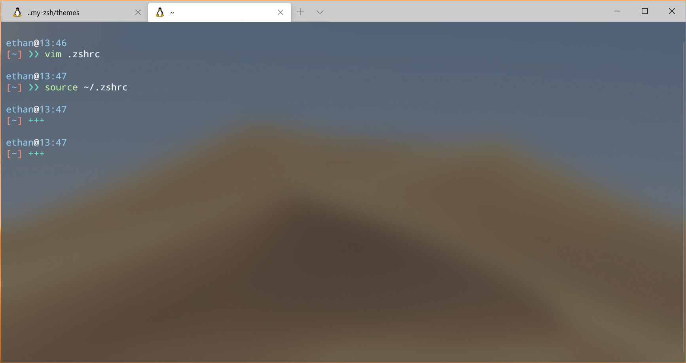
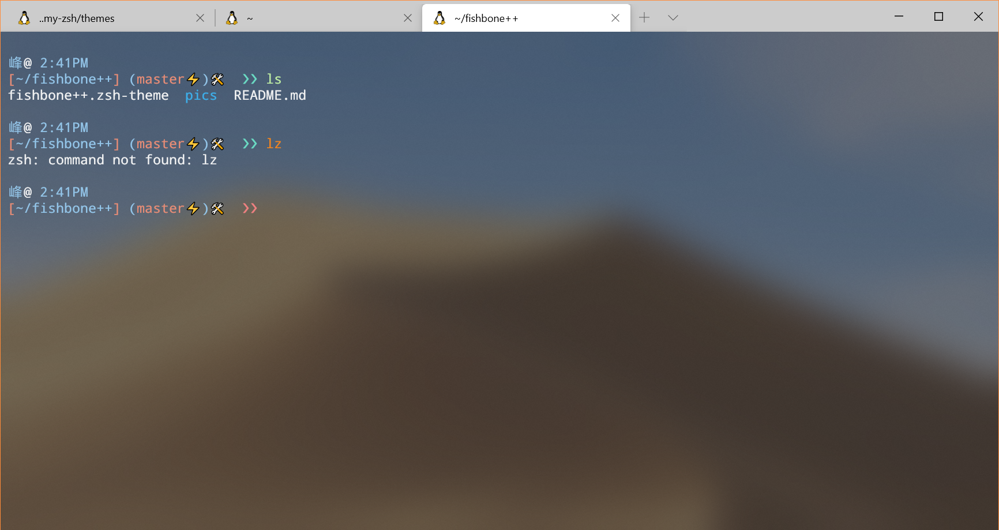
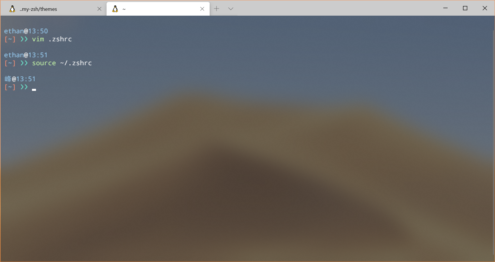
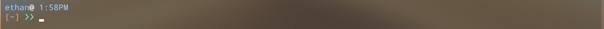
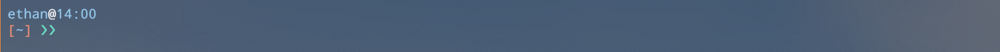
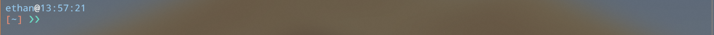
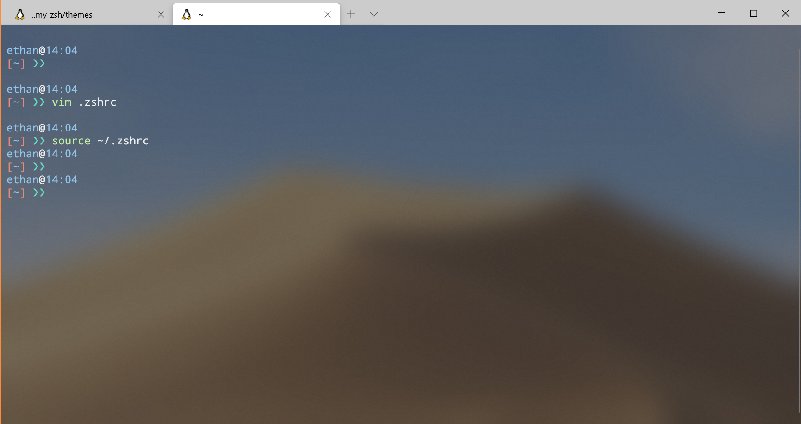
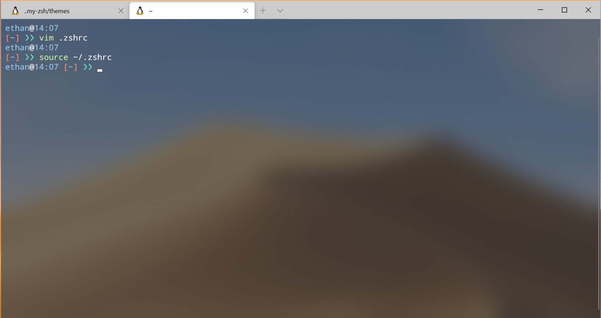
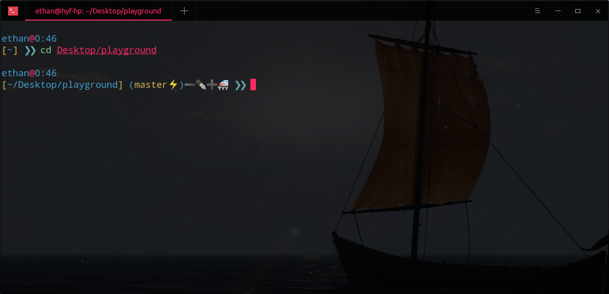

# fishbone++

A theme influenced by [oh-my-fish](https://github.com/oh-my-fish/oh-my-fish) theme fishbone 
and [oh-my-zsh](https://github.com/ohmyzsh) theme [typewritten](https://github.com/reobin/typewritten).
I really like these two themes, so I mix them together.




## Features

* full path from home to current directory
* emoji git status :)
* fault return indicator
* various customization
  * prompt layout
  * prompt symbol
  * time
  * new line after every command

## Install
Using zsh and [oh-my-zsh](https://github.com/ohmyzsh/ohmyzsh).
```zsh
git clone https://github.com/EYH0602/Fishbonepp
mv Fishbonepp/fishbone++.zsh-theme ~/.oh-my-zsh/themes/
rm Fishbonepp -rf
```

## Customization
### General Info

|Option|Descriptions|available options|default
|:---|:---|:---|:---|
|FISHBONEPP_PROMPT|the prompt symbol|any string|❯❯|
|FISHBONEPP_USER|the username indicator|any string|your default username|
|FISHBONEPP_TIME|current time|`"12HR"`, `"24HR"`, `"FULL"`|`"24HR"`|
|FISHBONEPP_NEWLINE|a new line after every command|`true`, `false`|`true`|
|FISHBONEPP_LINE_MODE|user@time, and dir and prompt on same line or not|`"singleline"`, `"multiline"`|`"multiline"`|

> To change these settings, modify your `.zshrc` file like  
`FISHBONEPP_TIME="12HR"`

### Prompt
You can change the prompt symbol in your `.zshrc` file, for example  
`FISHBONEPP_PROMPT="+++ "`



### False Reture Status
The prompt symbol's color will be changed to red.



### User
You can change the username in your `.zshrc` file, for example  
`FISHBONE_USER="峰"`



### Time
`FISHBONE_TIME="12HR"`


`FISHBONE_TIME="24HR"`


`FISHBONE_TIME="FULL"`


### New Line
Yy default, there will be a blank new line after the result of every command.  
You can disable by setting `"FISHBONEPP_NEWLINE" = false` in `.zshrc` file.



### Prompt Line Mode
By default, the theme is in `"multiline"` mode.  
You can change to `"singleline"` mode by `FISHBONEPP_LINE_MODE="singleline"` in `.zshrc` file.  



> I think singleline mode looks better without the new line :)


## Git Info
* ⚡ -- uncommitted changes

## Git Staus
* ➕ -- added but not yet committed
* ✒️ -- modified
* ➖ -- deleted
* ⁉️ -- renamed
* 🥺 -- unmerged
* 🚝 -- untracked

## Updates

### June 28, 2020

The old modified git status emoji causes some spacing problem on Gnome Terminal and Deepin Terminal, so I find a new emoji for that.




## More Info
* Terminal is [Windows Terminal](https://github.com/microsoft/terminal)
* Font Face is [Droid Sans Mono for Powerline](https://github.com/powerline/fonts), also works well if you are using a powerline theme like [agnoster](https://github.com/agnoster/agnoster-zsh-theme)
* Color Scheme is Breeze, other color schemes for Windows Terminal can be found in [Windows Terminal Themes](https://atomcorp.github.io/themes/)
```json
{
    "name": "Breeze",
    "black": "#12181d",
    "red": "#ee8080",
    "green": "#bfeea4",
    "yellow": "#e68c76",
    "blue": "#93c5e9",
    "purple": "#9b59b6",
    "cyan": "#6adac3",
    "white": "#eff0f1",
    "brightBlack": "#82b2c0",
    "brightRed": "#f5851d",
    "brightGreen": "#1cdc9a",
    "brightYellow": "#fdbc4b",
    "brightBlue": "#3daee9",
    "brightPurple": "#57b4df",
    "brightCyan": "#62dd69",
    "brightWhite": "#fcfcfc",
    "background": "#31363b",
    "foreground": "#eff0f1"
}
```

